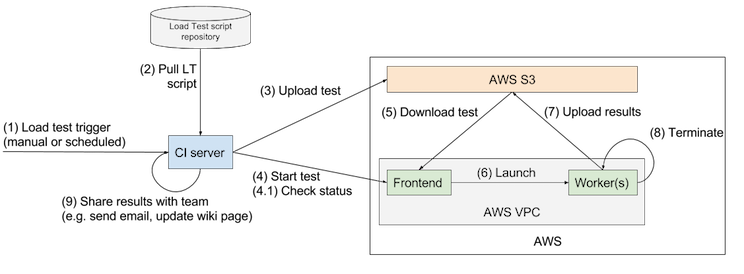

[](https://travis-ci.org/ingojaeckel/armory)
[](https://codecov.io/gh/ingojaeckel/armory)

# Armory - a load testing-as-a-service framework.

Armory is a framework to simplify load testing micro-services. It removes the need to manage load test instances, copy scripts, upload results, etc. If you are load testing a lot of different services, Armory might help you to unify some of the different testing approaches applied by your team. Most importantly it helps you to get rid of those idle load generator instances.

**Status**: Armory is not ready for prime time yet. It is still under active development. Proceed with caution. Do not use this in your production AWS account. Only provide very limited permissions to Armory.

# Usage

Armory attempts to integrate well with your existing CI/CD processes. Once deployed you can trigger and monitor load tests from your CI server. The typical use of Armory can be broken down into the following steps:



1. A new test is triggered by the build server manually or scheduled (e.g. daily test).
2. The build server pulls your load test scripts from a repository. Once all data is pulled the CI server will package those files to build a LT artifact file (see below for information about the format).
3. The CI server uploads the LT artifact to S3.
4. The CI server triggers the execution of a new test by sending an HTTP request to the Armory Frontend instance. This will return a test ID. The ID can be used to check the status of the test periodically.

# Getting started

## Run load tests via Armory

* Create a new load test package. For more information on the expected LT package file format see below.
* Start the test by invoking a `PUT /rest/test` request against the Armory frontend (request format below). This will return a unique load test identifier.
* Check the LT status by invoking a `GET /rest/rest?id={test-id}`. Let your CI server poll for the test status.

### Load test package format

A valid load test package is a `.tar.bz2` file containing the following files & directories:

* `/run.sh`: script which should be executed to start load test; *required*
* `/sim/*`: any simulation files or supporting source code; *required*
* `/misc/*`: additional files that are necessary to run the load test e.g. input files that are consumed by the LT simulation; optional
* `/lib/*.jar`: libraries that are required in order to run the simulation i.e. dependencies of the simulation which are not already part of Gatling; optional

Checkout the `/doc/example-archive/` folder for an example load test archive.

### Submit load tests to Armory

To start a new load test send the following request to the Armory frontend:

* PUT /rest/test
* Body:
    * artifact-url: URL in S3 to the Load Test Archive file that should be run
    * output: URL in S3 to where the aggregated results should be uploaded.
    * instance-count: Number of EC2 instances (workers)
    * instance-type: Type of EC2 instances
    * simulation-class: Name of the simulation class
* Response:
    * Load test ID - can be used to check the status while the test is running
* Example Body:

```
PUT
{
  "artifact-url":     "https://s3-us-west-1.amazonaws.com/my-loadtest-result-bucket/example.tar.bz2",
  "output":           "s3://output/",
  "instance-count":   1,
  "instance-type":    "t2.micro",
  "region":           "us-east-1",
  "simulation-class": "com.example.Loadtest"
}
```

* Example Response:

```
{
  "id": "123"
}
```

### Retrieve the status of a running load test

Send the following request to the Armory frontend server:

* GET /rest/test?id={test-id}
* Response:

```
{ "status": "starting|running|..." }
```

* Example Response:

```
{
  "status": "running"
}
```

## Deploy Armory to EC2

* `git clone git@github.com:ingojaeckel/armory.git`
* Adjust the configuration in `src/my_configuration.go`. This includes your EC2 security group, VPC subnet, IAM information, etc. Insert a access/secret key pair which is authorized to start EC2 instances and upload results to the bucket you configured.
    * There are existing Packer & Terraform scripts within the `/infra` folder that will help you to setup all infrastructure needed to run Armory (the VPC, subnet, IAM profiles, CodeDeploy, an EC2 instance acting as the frontend, etc).
* Run the following to build the Armory executable:

```
cd src
./scripts/build.sh
```

* Deploy the executable to an EC2 instance. A `t2.nano` instance will be sufficient. Consider reusing the `/scripts/{package_for,trigger}_codedeploy.sh` scripts and the configuration from `/infra/codedeploy` to deploy Armory.

# Building blocks

The Armory framework consists of the following technical building blocks:

* [Gatling](https://gatling.io/) as a load generator. Load test scripts are written in [Scala](https://www.scala-lang.org/).
* A RESTful web app written in [Golang](https://golang.org) for the frontend and the load generator instances.
* [packer](https://www.packer.io/) to create the AMIs we are running on EC2.
* [terraform](https://www.terraform.io/) to manage the infrastructure required to run load tests.
* [Docker](https://www.docker.com) for repeatable builds.
* AWS [CodeDeploy](https://aws.amazon.com/codedeploy/) for deployments and AWS [EC2](https://aws.amazon.com/ec2/) & [S3](https://aws.amazon.com/s3/) to run the tests.
